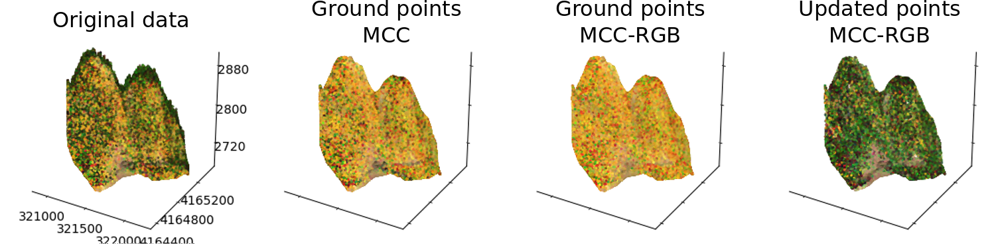

# pymccrgb

[](https://travis-ci.com/rmsare/pymccrgb)
[](https://pymccrgb.readthedocs.io/en/latest/?badge=latest)

**pymccrgb** is a Python package for multiscale curvature classification of
point clouds with color attributes. 

It extends a popular classification method
([MCC lidar](https://sourceforge.net/p/mcclidar/wiki/Home/)) [[0]](#references) to point cloud datasets with multiple color channels, such as those
commonly produced in surveys using drone photography or other platforms. It can be used to distinguish points from the
ground surface and low vegetation in data produced by structure from motion photogrammetry,
stereo photogrammetry, or multi-spectral lidar scanning, or to filter colorized lidar point clouds.

The intended users are scientists in geomorphology, ecology, or planetary science
who want to classify point clouds for topographic analysis, canopy height measurements, or other spectral classification.

### Installation

This package is developed for Linux and Python 3.6+. It depends on common 
Python packages like sklearn, numpy, the LibLAS C API, and 
[MCC Python bindings](https://github.com/stgl/pymcc).

You can install it with `conda`:

```bash
conda env create -n pymcc
conda activate pymcc
conda install pymccrgb -c conda-forge
```

### Requirements

The LibLAS C library is required for MCC and `pymccrgb`. The MCC wrapper also 
requires Boost and the C++11 or later standard library. These are installed 
with the conda package.

Refer to the [documentation](https://pymccrgb.readthedocs.io/en/latest/installation.html)
and the [LibLAS install guide](https://liblas.org/start.html#installation) for 
instructions for installing LibLAS from source.

### Examples

Example notebooks are available in the docs or at [docs/source/examples](docs/source/examples).

#### Topography under tree cover

```python
from pymccrgb import mcc, mcc_rgb
from pymccrgb.datasets import load_mammoth_lidar
from pymccrgb.plotting import plot_results

# Load sample data (Mammoth Mountain, CA)
data = load_mammoth_lidar(npoints=1e6)

# MCC algorithm
ground_mcc, labels_mcc = mcc(data)

# MCC-RGB algorithm
ground_mccrgb, labels_mccrgb = mcc_rgb(data)

plot_results(data, labels_mcc, labels_mccrgb)
```

[]()

Results of MCC and MCC-RGB on a forested area near Mammoth Mountain, CA. 

### Documentation

Read the documentation for example use cases, an API reference, and more at [pymccrgb.readthedocs.io](https://pymccrgb.readthedocs.io). 

### Contributing

#### Bug reports

Bug reports are much appreciated. Please [open an issue](https://github.com/rmsare/pymccrgb/issues/new) with the `bug` label,
and provide a minimal example illustrating the problem.

#### Suggestions

Feel free to [suggest new features](https://github.com/rmsare/pymccrgb/issues/new) in an issue with the `new-feature` label.

#### Pull requests

If you would like to add a feature or fix a bug, please fork the repository, create a feature branch, and [submit a PR](https://github.com/rmsare/pymccrgb/compare) and reference any relevant issues. There are nice guides to contributing with GitHub [here](https://akrabat.com/the-beginners-guide-to-contributing-to-a-github-project/) and [here](https://yourfirstpr.github.io/). Please include tests where appropriate and check that the test suite passes (a Travis build or `pytest pymccrgb/tests`) before submitting.

### Support and questions

Please [open an issue](https://github.com/rmsare/pymccrgb/issues/new) with your question.

### References

[0] Evans, J. S., & Hudak, A. T. 2007. A multiscale curvature algorithm for classifying discrete return LiDAR in forested environments. IEEE Transactions on Geoscience and Remote Sensing, 45(4), 1029-1038 [doi](https://doi.org/10.1109/TGRS.2006.890412) 

### License

This work is licensed under the MIT License (see [LICENSE](LICENSE)). It also
incorporates a wrapper for the [`mcc-lidar` implementation](https://sourceforge.net/p/mcclidar),
which is distributed under the Apache license (see [LICENSE.txt](https://sourceforge.net/p/mcclidar/code/HEAD/tree/tags/2.1/LICENSE.txt)).
